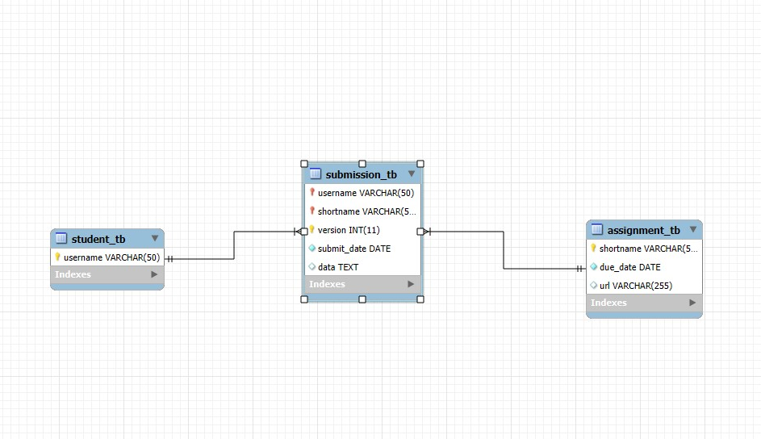

# Finals Lab Task 2 - Transforming ER into Relational Tables

## Task 1 -  Query statements

SELECT * FROM student_tb;

SELECT * FROM assignment_tb;

SELECT * FROM submission_tb;

## Task 2 - Table Structure 

CREATE DATABASE student_assignment_db;
USE student_assignment_db;

CREATE TABLE student_tb (
username VARCHAR(50) PRIMARY KEY
);

CREATE TABLE assignment_tb (
shortname VARCHAR(50) PRIMARY KEY,
due_date DATE NOT NULL,
url VARCHAR(255) DEFAULT NULL
);

CREATE TABLE submission_tb (
username VARCHAR(50),
shortname VARCHAR(50),
version INT,
submit_date DATE NOT NULL,
data TEXT,

    PRIMARY KEY (username, shortname, version),
    
    FOREIGN KEY (username) REFERENCES student_tb(username)
        ON DELETE CASCADE ON UPDATE CASCADE,

    FOREIGN KEY (shortname) REFERENCES assignment_tb(shortname)
        ON DELETE CASCADE ON UPDATE CASCADE
);

INSERT INTO student_tb (username) VALUES ('Naythan'), ('Levy');

INSERT INTO assignment_tb (shortname, due_date, url) 
VALUES 
('EDM19', '2025-04-21','http://assignments.com/EDM'), 
('NCMA219', '2025-05-12','http://assignments.com/ncma219');

INSERT INTO submission_tb (username, shortname, version, submit_date, data)
VALUES
('Sean', 'EDM19', 1, '2025-04-21', 'First Submission by Sean'),
('Sean', 'EDM19', 2, '2025-04-21', 'Updated Submission by Sean'),
('Gutts', 'NCMA219', 1, '2025-05-12', 'Submission by Gutts');

## Task 3 -  ER Diagram or Relational schema from phpMyAdmin or Workbench

 

## Task 4 - Sql copy of the database and table structures

CREATE DATABASE student_assignment_db;
USE student_assignment_db;

CREATE TABLE student_tb (
username VARCHAR(50) PRIMARY KEY
);

CREATE TABLE assignment_tb (
shortname VARCHAR(50) PRIMARY KEY,
due_date DATE NOT NULL,
url VARCHAR(255) DEFAULT NULL
);

CREATE TABLE submission_tb (
username VARCHAR(50),
shortname VARCHAR(50),
version INT,
submit_date DATE NOT NULL,
data TEXT,

    PRIMARY KEY (username, shortname, version),
    
    FOREIGN KEY (username) REFERENCES student_tb(username)
        ON DELETE CASCADE ON UPDATE CASCADE,

    FOREIGN KEY (shortname) REFERENCES assignment_tb(shortname)
        ON DELETE CASCADE ON UPDATE CASCADE
);

INSERT INTO student_tb (username) VALUES ('Naythan'), ('Levy');

INSERT INTO assignment_tb (shortname, due_date, url) 
VALUES 
('EDM19', '2025-04-21','http://assignments.com/EDM'), 
('NCMA219', '2025-05-12','http://assignments.com/ncma219');

INSERT INTO submission_tb (username, shortname, version, submit_date, data)
VALUES
('Naythan', 'EDM19', 1, '2025-04-21', 'First Submission by Naythan'),
('Naythan', 'EDM19', 2, '2025-04-21', 'Updated Submission by Naythan'),
('Levy', 'NCMA219', 1, '2025-05-12', 'Submission by Levy');

SELECT * FROM student_tb;

SELECT * FROM assignment_tb;

SELECT * FROM submission_tb;
