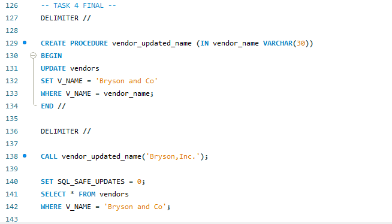
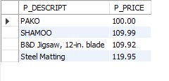

## Finals Lab Task 5 - Using SQL views and Stored Procedures and Stored Functions
In this portfolio, I showcase how I used SQL views, stored procedures, and functions to handle and work with database data. I included examples like using views to filter information, stored procedures to update records, and functions to pull specific data.

### Step by Step Process
#### Step 1
 Create a VIEW that will display the vendors_code, vendors name, product description p_indate, of all products with p_indate from 2002 onwards
#### Step 2
- Create a VIEW that will display all products whose price range is between 100-150
#### Step 3
- Create a VIEW that will COMPUTE for the (TOTAL_PRICE) of ALL PRODUCTS by getting the (P_ONHAND x P_PRICE) Sold by vendors with the following v_code (21344, 23119 and 24288)
#### Step 4
- Create a STORED PROCEDURE that WILL take a SINGLE PARAMETER and UPDATED the Name of Vendor ‘Bryson,Inc.’ to ‘Bryson and Co’.
#### Step 5
- Create a Function that will take 2 parameters(v_code and v_state) and display All the product description and price based on the parameters passed to the function
Query Statements and Table Structures
### Task 1 Query
 

### Task 2 Query
 

### Task 3 Query
 

### Task 4 Query
 

### Task 5 Query
 

### Task 1 Table
 

### Task 2 Table
 

### Task 3 Table
 

### Task 4 Table
 

### Task 5 Table
 
