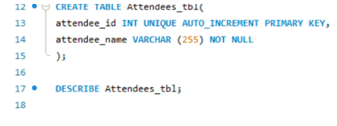

##  Final Task Lab 1: MySQL Basis

### Create an events table with fields

- event_id (int, auto-increment, primary key)
- event_name (VARCHAR, up to 255 characters, not null)

## Create an attendees table with fields
- attendee_id (int, auto-increment, primary key)
- attendee_name (VARCHAR, up to 255 characters, not null)
  
