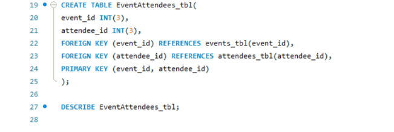
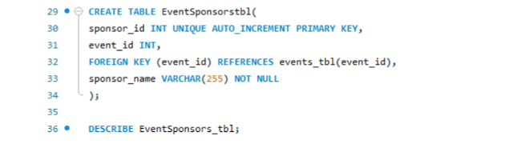

##  Final Task Lab 1: MySQL Basis

### Create an events table with fields

- event_id (int, auto-increment, primary key)
- event_name (VARCHAR, up to 255 characters, not null)

## Create an attendees table with fields
- attendee_id (int, auto-increment, primary key)
- attendee_name (VARCHAR, up to 255 characters, not null)

## Create an event attendees table with fields
- event_id (int, foreign key to events.event_id)
- attendee_id (int, foreign key to attendees.attendee_id)
- Composite primary key on (event_id, attendee_id)

## Create an event sponsors table with fields
- sponsor_id (int, auto-increment, primary key)
- event_id (int, foreign key to events.event_id)
- sponsor_name (VARCHAR, up to 255 characters, not null)

