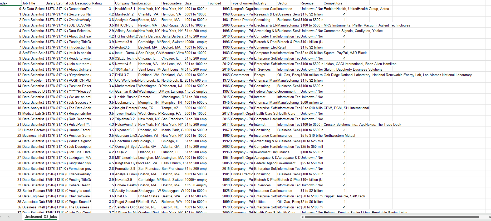
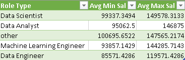
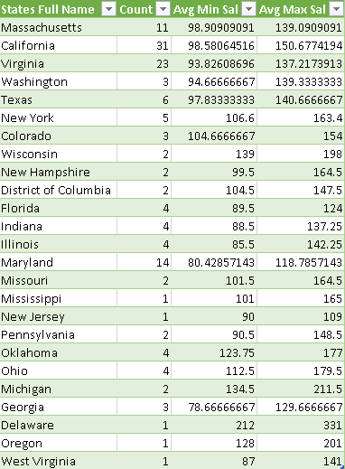
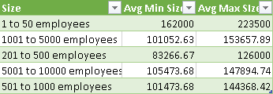
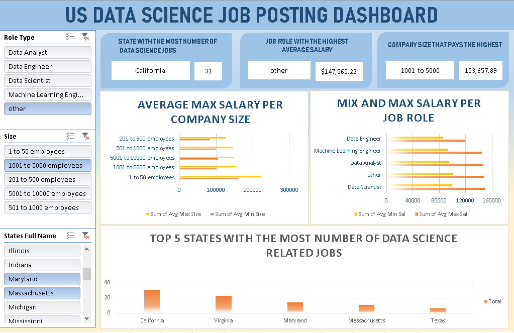
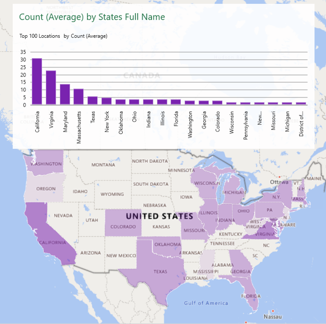
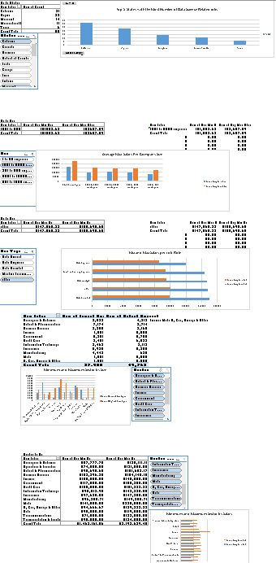
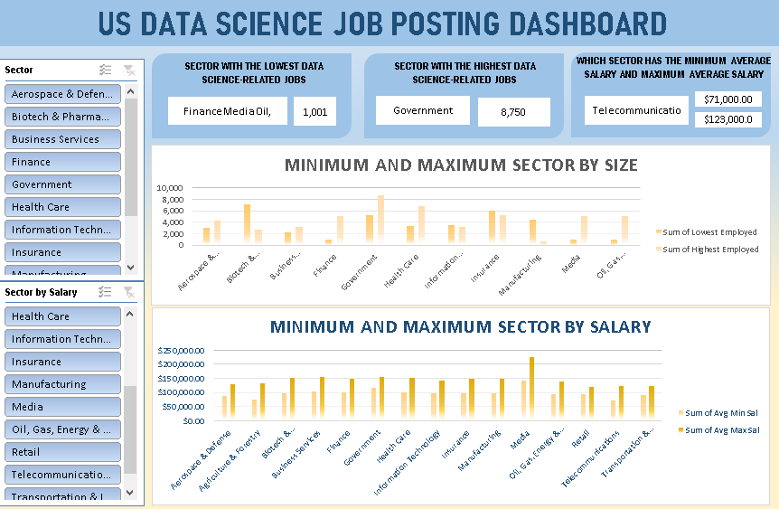

### Midterm Lab Task 3. Creating PIVOT TABLE and DASHBOARD
Focusing on building the Dashboard with the necessary Pivot Tables, charts, and interactivity using slicers. I'll break down the steps to ensure clarity:

## Step 1: Data Preparation
Load Data: Open Worksheet on Uncleaned DS Jobs and the transform tables

## Step 2 - Pivot Table Creation
- Sal by Role:

- Sal by State:

- Sal by Size:

## STEP 3 - Design Your Dashboard

- Insert Chart:

Salary by Role Chart: Select your PivotTable for Salary by Role, and then go to Insert > Recommended Charts. Choose a Bar Chart or Column Chart for this.
Salary by State Chart: Similarly, select the PivotTable for Salary by State and insert a Bar Chart or Column Chart.
Salary by Size Chart: Use a Pie Chart or Bar Chart for visualizing Salary by Size.

- Map Chart:

If you want to use a Map Chart for Salary by State, select the State and Salary data from your PivotTable, and then go to Insert > Maps > Filled Map. Ensure that your state names are recognized by Excel for map generation.

## STEP 4 - Insert Slicers for Interactivity
- Insert Slices:

Select a PivotTable (e.g., Salary by Role) and go to Insert > Slicer.
Choose the fields you want to filter by, such as State, Size, or Role.
Repeat this for other PivotTables as needed.

## STEP 5 - Apply Design and Color Customizations
Color Customization: Home → Cell Styles or manually color chart elements. Chart Design: Select chart → Chart Tools → Design.

## STEP 6 - Make the Dashboard Interactive
Connect Slicers: Right-click slicer → Report Connections → select all relevant PivotTables. Test Interactivity: Click slicer options to verify filtering updates the dashboard.

## STEP 7 - Insert Dashboard

## STEP 8 - Insert Map

